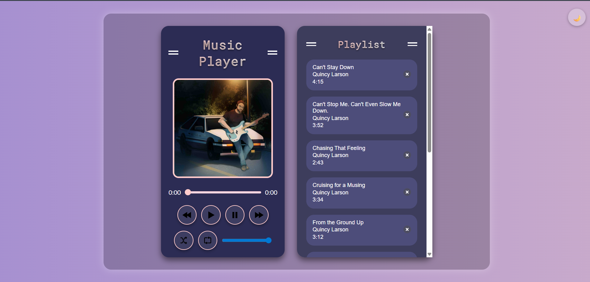

# 🎧 Responsive Music Player Web App

A fully functional, responsive **Music Player Web App** built using **HTML, CSS, and JavaScript**. Designed with a modern aesthetic and packed with interactive features, this app offers a smooth music experience across all devices.

---

## 🌟 Features

- 🎵 Play, Pause, Next, Previous controls
- 📃 Dynamic playlist with real-time updates
- 🔁 Repeat and 🔀 Shuffle functionality
- 🌙 Dark mode toggle (with persistent theme using localStorage)
- 🎨 Animated gradient background
- 🔊 Volume control
- 🖼️ Unique album art for each song
- 💡 Responsive design for all screen sizes

---

## 🚀 Live Demo

🔗 [Click here to view the live demo](https://rakshithdn.github.io/responsive-music-player/)  
> _Deployed using **GitHub Pages** from the root of this repository._

---
## 📸 Preview

---

## 🛠️ Tech Stack

- **HTML5**
- **CSS3** (with custom animations)
- **JavaScript (ES6+)**
- **Git & GitHub** (for version control and deployment)

---

## 🙋‍♂️ Author

**Rakshith D N**  
🔗 [GitHub Profile](https://github.com/RakshithDN)

---

> _Feel free to fork or explore this project. Contributions and feedback are always welcome!_
